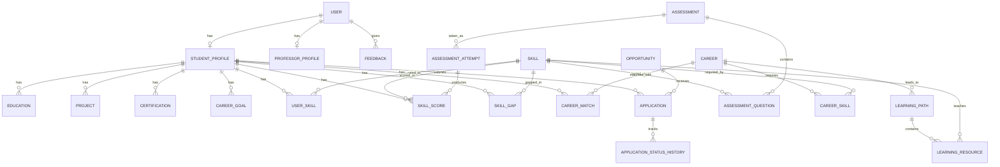

# SkillMap AI — Architecture

> Phase 0 deliverable: the full system design and the repository/folder structure that
> implements it. Feature code is intentionally **not** implemented yet; every module
> below maps to a folder that already exists in the repo.

## 1. System Overview

SkillMap AI is a role-based career-guidance platform. A student builds a **digital career
profile** (skills, interests, education, projects, certifications, career goal), takes
**skill assessments** to obtain objective **skill scores**, and the system derives:

1. **Skill Gap Analysis** — current score vs. the score a target career requires.
2. **Career Matching** — careers ranked by match percentage from the gap analysis.
3. **Learning Recommendations** — learning paths/resources that close the highest-priority gaps.
4. **Opportunity Matching** — jobs/internships whose required skills overlap the student's profile.
5. **Application Tracking** — status lifecycle from *Draft → Submitted → … → Offer/Rejected*.

Professors review students' academic + skill data, view assessment results and readiness,
and give guidance (feedback). Admins manage the master data (users, skills, careers,
assessments, opportunities, learning resources) and see platform analytics.

```
┌──────────────────────────┐         REST /api/v1 (JWT)          ┌──────────────────────────┐
│  React SPA (frontend/)   │ ──────────────────────────────────► │  Django API (backend/)   │
│  - Router + role guards  │ ◄────────────────────────────────── │  DRF + SimpleJWT         │
│  - Auth context (JWT)    │         JSON (token + payload)      │  - 7 Django apps         │
│  - API layer (axios)     │                                     │  - PostgreSQL/SQLite     │
│  - Recharts dashboards   │                                     │  - AI services (core)    │
└──────────────────────────┘                                     └──────────────────────────┘
```

## 2. Tech Stack & Choices

| Concern            | Choice                                              | Why                                                            |
| ------------------ | --------------------------------------------------- | -------------------------------------------------------------- |
| Frontend           | React 19 + TypeScript + Vite                        | Fast dev/build, strict typing shared with API contract         |
| Styling            | Tailwind CSS v4 (Vite plugin)                       | Utility-first, design tokens in CSS, no build step              |
| Charts             | Recharts                                            | Composable, declarative radar/bar/line charts for dashboards    |
| Backend            | Django 6 + Django REST Framework                    | Admin panel for master data, batteries-included, SIH-friendly  |
| Auth               | JWT (simplejwt) — access + refresh                  | Stateless, SPA-friendly, standard for React + DRF stacks        |
| Database           | PostgreSQL 16 (SQLite fallback in dev)              | Postgres in prod; SQLite lets the app run with zero setup       |
| AI/ML              | Pure-Python scoring services (`backend/core`)       | Deterministic, testable; no heavy deps, no external API needed  |

**Database switch** is environment-driven: if `DB_ENGINE=postgres` is set the settings use
PostgreSQL via `psycopg`; otherwise SQLite. No code changes required.

## 3. Backend Architecture (`backend/`)

```
backend/
├── manage.py
├── requirements.txt
├── .env.example
├── config/                     # Django project ("config")
│   ├── settings.py             # env-driven settings (DB, JWT, CORS, DRF)
│   ├── urls.py                 # /api/v1/ → app url configs
│   └── wsgi.py / asgi.py
└── apps/
    ├── users/                  # User model, roles, JWT auth
    ├── students/               # StudentProfile, Education, Project, Certification, CareerGoal, Feedback
    ├── skills/                 # Skill catalog, UserSkill, SkillScore, SkillGap
    ├── assessments/            # Assessment, AssessmentQuestion, AssessmentAttempt
    ├── careers/                # Career, CareerSkill, CareerMatch
    ├── opportunities/          # Opportunity postings
    ├── applications/           # Application, ApplicationStatusHistory
    ├── learning/               # LearningPath, LearningPathStep, LearningResource
    ├── recommendations/        # Gap analysis + career/opportunity matching (service layer)
    ├── analytics/              # Read-only aggregation endpoints (no models)
    ├── notifications/          # Notification model
    └── core/                   # Enums, permissions, pagination, AI/ML services
```

Each app follows the same contract:

- `models.py` — data model (Postgres tables)
- `serializers.py` — API serialization + validation
- `views.py` / `viewsets.py` — ViewSets + permission classes
- `urls.py` — namespaced routes, mounted in `config/urls.py`
- `services.py` — business logic (used by analytics & matching; kept out of views for testability)

### 3.1 Domain Model



Key entities (full fields are defined app-by-app in later phases):

| Entity | Purpose |
| --- | --- |
| `User` | Custom user with `role` (STUDENT / PROFESSOR / ADMIN); unique email |
| `StudentProfile` | Core digital profile: college, department, year, CGPA, about, links |
| `Education / Project / Certification` | Profile building blocks |
| `CareerGoal` | Target roles, industries, locations, salary expectation |
| `Skill` | Master skill catalog (name, category) |
| `UserSkill` | Student's self-assessed proficiency (1–5) |
| `Assessment / AssessmentQuestion / AssessmentAttempt` | Test bank + attempt lifecycle |
| `SkillScore` | Scored 0–100 per skill; source = SELF / ASSESSMENT / PROFESSOR |
| `SkillGap` | Cached gap per skill vs. target career (score delta + priority) |
| `Career / CareerSkill` | Career catalog + required skill levels |
| `CareerMatch` | Computed match % per student/career (strengths + gaps snapshot) |
| `LearningPath / LearningResource` | Curated upskilling content |
| `Opportunity` | Job / internship postings with required skills |
| `Application` | Student application with status lifecycle |
| `ApplicationStatusHistory` | Audit trail of status changes |
| `Feedback` | Professor guidance notes for a student |

### 3.2 API Design (REST, versioned `/api/v1/`)

| Area | Endpoints (planned) | Roles |
| --- | --- | --- |
| Auth | `POST /auth/register`, `POST /auth/login`, `POST /auth/refresh`, `POST /auth/logout`, `GET /auth/me`, `POST /auth/forgot-password`, `POST /auth/reset-password` | public / any |
| Student profile | `GET/PATCH /students/me`, nested CRUD for `/education`, `/projects`, `/certifications`, `/career-goal`, `/skills` | student |
| Assessment | `GET /assessments`, `POST /assessments/{id}/start`, `POST /assessments/{id}/submit`, `GET /scores` | student |
| Recommendations | `GET /recommendations/gap-analysis`, `/career-matches`, `/learning-paths`, `/opportunities` | student, professor |
| Opportunities | `GET /opportunities`, `GET /opportunities/{id}`, `POST /applications`, `GET/PATCH /applications/{id}` | student |
| Professor | `GET /professors/students`, `GET /professors/students/{id}` (full dossier), `POST /professors/students/{id}/feedback`, `GET /professors/analytics` | professor |
| Admin (master data) | CRUD `/admin/users`, `/admin/skills`, `/admin/careers`, `/admin/assessments`, `/admin/opportunities`, `/admin/resources` | admin |
| Admin analytics | `GET /admin/analytics` (platform stats), `POST /notifications/send` | admin |

Conventions: JSON only; pagination `page` / `page_size`; errors as `{"detail": …}` with
proper HTTP status; all endpoints under `/api/v1/`; permissions enforced per-role.

### 3.3 Authentication & Role-Based Access Control

- **JWT access + refresh** via `djangorestframework-simplejwt`; access token in memory +
  localStorage for the SPA, refresh flow keeps sessions alive.
- **RBAC** enforced in two layers:
  1. DRF permission classes: `IsStudent`, `IsProfessor`, `IsAdmin` (in `core/permissions.py`)
     — reject before business logic runs.
  2. Object-level ownership checks (a student only reads/writes their own profile,
     applications, and scores).
- Custom user model (`AUTH_USER_MODEL = accounts.User`) is defined **now** because
  retrofitting it later requires a painful migration.

### 3.4 AI / ML Services (`backend/apps/core/services/`)

Pure-Python, deterministic modules (no external API, demo-safe for SIH):

- `scoring.py` — convert assessment answers → skill score (0–100) with per-question weights.
- `gap.py` — gap = required − current per skill; priority from gap size × career-skill importance.
- `matching.py` — cosine-style similarity between student skill vector and career/opportunity
  requirement vectors; returns match % + strengths/gaps.
- `readiness.py` — overall career-readiness index (profile completeness, scores, gap closure).

All services are unit-testable and called from the `recommendations` / `analytics` apps.

## 4. Frontend Architecture (`frontend/`)

```
frontend/
├── index.html
├── vite.config.ts              # React + Tailwind v4 plugins
├── tailwind theme in src/index.css   # @theme tokens (navy/blue palette)
└── src/
    ├── main.tsx                # entry: providers (Auth) + router
    ├── App.tsx                 # provider composition
    ├── api/
    │   ├── client.ts           # axios instance: base URL + JWT interceptor + 401 refresh
    │   └── endpoints/          # one module per domain (auth, students, skills, careers,
    │                           #   opportunities, professors, admin)
    ├── auth/
    │   ├── AuthContext.tsx     # user state, tokens, login/register/logout actions
    │   └── guards.tsx          # <RequireRole role="STUDENT|PROFESSOR|ADMIN">
    ├── router/
    │   ├── routes.tsx          # SINGLE route table: path → title/description/role/phase
    │   └── AppRouter.tsx       # builds guarded routes + nav from the table
    ├── components/
    │   ├── ui/                 # Button, Card, Input, Badge, ProgressBar, Modal, Spinner,
    │   │                       #   StatCard, EmptyState (all real, reusable)
    │   ├── layout/             # AppLayout, Sidebar, Topbar, Footer
    │   └── charts/             # recharts wrappers (RadarChart, BarChart, LineChart, Donut)
    ├── pages/
    │   ├── auth/               # Login, Register
    │   ├── student/            # Dashboard, Profile, Skills, Assessment, Careers,
    │   │                       #   Learning, Opportunities, Applications
    │   ├── professor/          # Dashboard, Students, StudentDetail, Analytics
    │   ├── admin/              # Dashboard, Users, Skills, Careers, Assessments,
    │   │                       #   Opportunities, Resources, Analytics
    │   └── common/             # NotFound, FeaturePlaceholder (phase scaffolding)
    ├── hooks/                  # useAuth, useApi (loading/error/data), useDebounce…
    ├── types/                  # TS types mirroring the API models
    └── utils/                  # cn(), formatters (percent, date), constants
```

### 4.1 Routing & Navigation

- One **route table** (`router/routes.tsx`) is the single source of truth: every route
  declares its `path`, `title`, `role` and `phase`. The sidebar nav and the router both
  render from it, so navigation can never drift from the router.
- `RequireRole` guards redirect unauthenticated users to `/auth/login` and unauthorized
  users to their role's dashboard.
- During scaffolding, unimplemented features render `FeaturePlaceholder` (title +
  description + target phase, no fake buttons). Each phase replaces placeholders with
  real pages.

### 4.2 Data Flow

`Page` → `useApi`/endpoint module → axios (`client.ts`, attaches JWT, handles 401 refresh)
→ Django `/api/v1/` → serializers → PostgreSQL. Server responses are typed against
`src/types/`, so model renames fail the build instead of breaking at runtime.

## 5. Environment Variables

| Variable | Where | Purpose |
| --- | --- | --- |
| `DJANGO_SECRET_KEY` | backend | Django secret (required in prod) |
| `DJANGO_DEBUG` | backend | Debug mode toggle |
| `DJANGO_ALLOWED_HOSTS` | backend | Host allow-list |
| `DB_ENGINE` / `DB_NAME` / `DB_USER` / `DB_PASSWORD` / `DB_HOST` / `DB_PORT` | backend | Postgres connection (SQLite if unset) |
| `CORS_ALLOWED_ORIGINS` | backend | Allowed SPA origins |
| `JWT_ACCESS_MINUTES` / `JWT_REFRESH_DAYS` | backend | Token lifetimes |
| `VITE_API_BASE_URL` | frontend | API base URL |

Never hardcode secrets; every sensitive value reads from the environment (`.env` files
are git-ignored, `.env.example` is committed).

## 6. Development Workflow

Phase-based, per the [ROADMAP](ROADMAP.md). After every phase:

1. Build/run the project (`manage.py check`, `npm run build`).
2. Fix any errors.
3. Confirm the phase's features work.
4. Ensure no regression in earlier phases.

## 7. Deployment Notes (post-MVP)

- **Backend**: `gunicorn config.wsgi` behind nginx; Postgres via managed service.
- **Frontend**: static build (`npm run build`) served by nginx/CDN, env-injected `VITE_API_BASE_URL`.
- **Env**: production `DJANGO_DEBUG=false`, real secret key, allowed-hosts locked down.
- **Backups**: Postgres dumps; **media**: user avatars/artifacts on object storage.